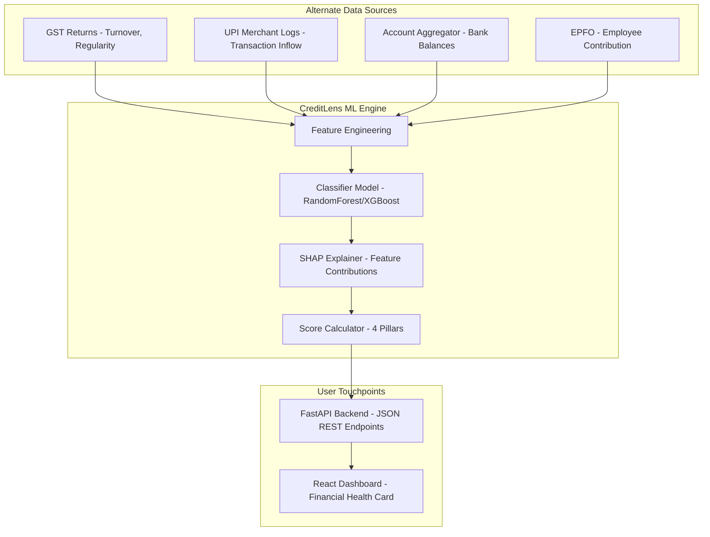

# CreditLens AI — System Architecture

This document outlines the system architecture, scoring methodology, and data pipeline for **CreditLens AI** — a next-generation MSME Financial Health Card built for **IDBI Innovate 2026 (Track 03)**.

---

## 1. Core Concept & Business Logic

Traditional credit bureaus and underwriting rely heavily on formal credit history, balance sheets, and collateral. This excludes **New-to-Credit (NTC)** and **New-to-Bank (NTB)** MSMEs.

**CreditLens AI** solves this by underwriting MSMEs using **alternate transaction and compliance data** gathered via GST returns, UPI transaction logs, EPFO statements, and Bank Account Aggregator feeds.

---

## 2. The Four Credit Pillars

Features are engineered and mapped into **four credit pillars**, representing different dimensions of creditworthiness:

| Pillar | Focus | Constituents | Weight |
|:---|:---|:---|:---|
| **Liquidity** | Cash availability & short-term debt serviceability | Avg Bank Balance, Cash Flow to EMI ratio, Net UPI Flow (Inflow - Outflow), EMI Burden ratio | 30% |
| **Stability** | Predictability & operational history | Monthly Inflow Volatility, EMI Bounce count (12m), Revenue per Customer, Years in Operation | 25% |
| **Growth** | Scale & expansion trajectory | GST Turnover growth (YoY), Employee Growth Trend, monthly UPI Transaction Volume, Employee count | 25% |
| **Compliance** | Financial discipline & regulatory adherence | GST Filing Regularity %, Input Tax Credit claimed %, EPFO Contribution Regularity %, Workforce Formality ratio | 20% |

---

## 3. Machine Learning & Credit Scoring Methodology

The system uses a **binary classifier** trained on realistic synthetic data to predict the probability of default ($P(\text{default})$) within the next 12 months.

### Model Pipeline
1. **Feature Engineering**: Logs continuous variables (bank balance, UPI flows, transactions) to handle skewness, scales features using a fitted `StandardScaler`.
2. **Classifier**: Gradient Boosted Trees (XGBoost Classifier, with a robust fallback to scikit-learn `RandomForestClassifier` if XGBoost is unavailable).
3. **Imbalance Handling**: The training set has an engineered ~10% default rate. Model training uses stratified splits and balances classes (using `class_weight='balanced'` or `scale_pos_weight`).

### Score Generation
- **Overall Score**: Derived from the predicted probability of default:
  $$\text{Overall Score} = (1 - P(\text{default})) \times 100$$
- **Sub-scores**: Calculated by grouping SHAP values (or feature contribution approximations) by credit pillar:
  1. Let $S_p$ be the sum of SHAP values for pillar $p$ (where a negative value indicates a lower default probability, which is positive for credit).
  2. Normalize the raw pillar SHAP values: $Z_p = \frac{S_p - \mu_{\text{SHAP}}}{\sigma_{\text{SHAP}}}$.
  3. Center the sub-score around the overall score:
     $$\text{SubScore}_p = \text{Overall Score} + Z_p \times 30$$
  4. Clip values to $[0, 100]$. This gives a meaningful, dynamically-weighted score relative to peers.

---

## 4. Technical Stack

* **Frontend**: Single Page React Application built with Vite. Styling is written using Vanilla CSS (custom properties inside `theme.css`) with Tailwind CSS classes for responsive layouts. Metrics visualization utilizes `recharts`.
* **Backend**: High-performance FastAPI backend. Exposes REST endpoints protected by JWT authentication.
* **Database**: MongoDB Atlas via the async Motor driver. Includes a **built-in in-memory database fallback** that mimics the MongoDB collection API for zero-config local development without a database connection.
